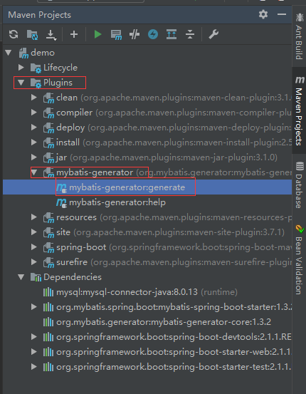
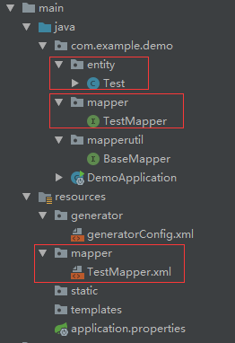

# MyBatis 通用 Mapper4 简介

通用 Mapper4 是一个可以实现任意 MyBatis 通用方法的框架，项目提供了常规的增删改查操作以及Example 相关的单表操作。

通用 Mapper 是为了解决 MyBatis 使用中 90% 的基本操作，使用它可以很方便的进行开发，可以节省开发人员大量的时间。

# pom导入依赖：
```

<!--通用Mapper-->
<dependency>
    <groupId>tk.mybatis</groupId>
    <artifactId>mapper</artifactId>
    <version>4.0.0</version>
</dependency>

<!--mybatis-->
<dependency>
    <groupId>org.mybatis.spring.boot</groupId>
    <artifactId>mybatis-spring-boot-starter</artifactId>
    <version>1.3.2</version>
</dependency>

<!--mybatis-generator-->
<dependency>
    <groupId>org.mybatis.generator</groupId>
    <artifactId>mybatis-generator-core</artifactId>
    <version>1.3.2</version>
</dependency>

<!--mysql-->
<dependency>
    <groupId>mysql</groupId>
    <artifactId>mysql-connector-java</artifactId>
    <scope>runtime</scope>
    <version>8.0.13</version>
</dependency>


<!-- mybatis generator 配置 -->
<plugin>
    <groupId>org.mybatis.generator</groupId>
    <artifactId>mybatis-generator-maven-plugin</artifactId>
    <version>1.3.6</version>
    <configuration>
        <configurationFile>
            ${basedir}/src/main/resources/generator/generatorConfig.xml
        </configurationFile>
        <overwrite>true</overwrite>
        <verbose>true</verbose>
    </configuration>
    <dependencies>
        <dependency>
            <groupId>mysql</groupId>
            <artifactId>mysql-connector-java</artifactId>
            <version>8.0.13</version>
        </dependency>
        <dependency>
            <groupId>tk.mybatis</groupId>
            <artifactId>mapper</artifactId>
            <version>4.0.0</version>
        </dependency>
    </dependencies>
</plugin>

```

# 创建数据库并配置：
``` 
use mydb;

DROP TABLE  IF EXISTS `test`;

CREATE TABLE `test`(
  `u_id` INT PRIMARY KEY AUTO_INCREMENT,
  `u_name` VARCHAR(16),
  `u_age` INT
)
  ENGINE = MyISAM
  AUTO_INCREMENT = 19
  DEFAULT CHARSET = utf8;

INSERT INTO `test` VALUES(NULL,'zs',15);
INSERT INTO `test` VALUES(NULL,'ls',16);
INSERT INTO `test` VALUES(NULL,'ww',17);
INSERT INTO `test` VALUES(NULL,'zl',18);
INSERT INTO `test` VALUES(NULL,'tq',19);
```

application.properties:
``` 
# database
spring.datasource.url=jdbc:mysql://127.0.0.1:3306/mydb?useUnicode=true&characterEncoding=utf8&useSSL=false&serverTimezone=GMT
spring.datasource.username=root
spring.datasource.password=admin
spring.datasource.driver-class-name=com.mysql.cj.jdbc.Driver


```


# 建BaseMapper
``` 
/*
 * 特别注意，该接口不能被扫描到，否则会出错
 * */
public interface BaseMapper<T> extends Mapper<T>, MySqlMapper<T> {

}
```


# 创建自动生成的配置：

``` 
<?xml version="1.0" encoding="UTF-8"?>
<!DOCTYPE generatorConfiguration
        PUBLIC "-//mybatis.org//DTD MyBatis Generator Configuration 1.0//EN"
        "http://mybatis.org/dtd/mybatis-generator-config_1_0.dtd">

<generatorConfiguration>
    <properties resource="application.properties"/>

    <!-- 数据库驱动:换成你本地的驱动包位置-->
    <classPathEntry
            location="C:\Users\13579\.m2\repository\mysql\mysql-connector-java\8.0.13\mysql-connector-java-8.0.13.jar"/>


    <context id="Mysql" targetRuntime="MyBatis3Simple" defaultModelType="flat">
        <property name="beginningDelimiter" value="`"/>
        <property name="endingDelimiter" value="`"/>

        <plugin type="tk.mybatis.mapper.generator.MapperPlugin">
            <property name="mappers" value="com.example.demo.mapperutil.BaseMapper"/>
            <property name="caseSensitive" value="true"/>
            <property name="forceAnnotation" value="true"/>
            <property name="beginningDelimiter" value="`"/>
            <property name="endingDelimiter" value="`"/>
        </plugin>

        <jdbcConnection driverClass="${spring.datasource.driver-class-name}"
                        connectionURL="${spring.datasource.url}"
                        userId="${spring.datasource.username}"
                        password="${spring.datasource.password}">
        </jdbcConnection>

        <javaModelGenerator targetPackage="com.example.demo.entity" targetProject="src/main/java"/>

        <sqlMapGenerator targetPackage="mapper" targetProject="src/main/resources"/>

        <javaClientGenerator targetPackage="com.example.demo.mapper" targetProject="src/main/java" type="XMLMAPPER"/>

        <table tableName="test">
            <!--mysql 配置-->
            <generatedKey column="id" sqlStatement="Mysql" identity="true"/>
            <!--oracle 配置-->
            <!--<generatedKey column="id" sqlStatement="select SEQ_{1}.nextval from dual" identity="false" type="pre"/>-->
        </table>
    </context>
</generatorConfiguration>
```
注意MapperPlugin中mapper使用BaseMapper


# plugin自动生成



生成的目录如下：



# 启动类设置mapper扫描

注意：@tk.mybatis.spring.annotation.MapperScan(basePackages = "mapper所在包名")

``` 
@tk.mybatis.spring.annotation.MapperScan(basePackages = "com.example.demo.mapper")
@SpringBootApplication
public class DemoApplication {

    public static void main(String[] args) {
        SpringApplication.run(DemoApplication.class, args);
    }

}
```
# 测试

``` 
@Autowired
TestMapper testMapper;

@Test
public void findById() {
    List<com.example.demo.entity.Test> userList = testMapper.select(null);
    userList.forEach(System.out::println);

}
```